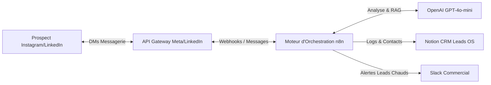
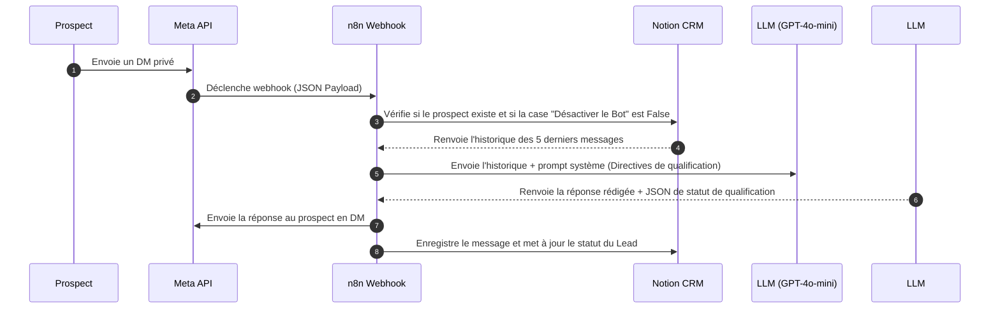
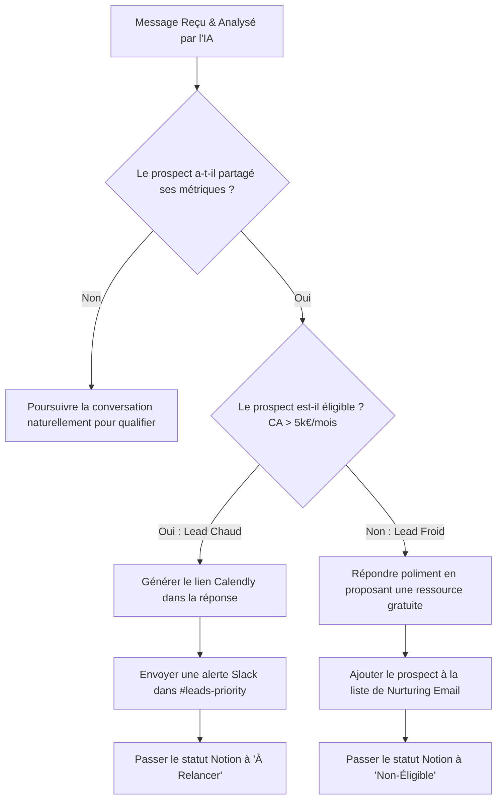

# Architecture Globale & Design Système - Setter Virtuel IA
*Document de cadrage technique initial et de flux de données*

Ce document détaille l'architecture macro, les calculs de rentabilité business (ROI) et les diagrammes de flux de données (DFD) pour l'automatisation du triage et du setting.

---

## 📈 Analyse de Valeur Business (ROI)
L'intégration de ce Setter Virtuel a deux objectifs financiers majeurs :
1. **Élimination du lead-lag (temps de réponse) :** Diviser par 120 le temps de réponse aux DMs (de 4 heures à moins de 2 minutes), ce qui augmente statistiquement le taux de booking de 30%.
2. **Économie de ressources :** Pour une agence ou un infopreneur, employer un setter humain à plein temps représente un coût de 1 500 € à 2 500 € par mois (salaire ou commission). L'infrastructure technique (n8n + API) coûte moins de 50 € par mois pour traiter un volume équivalent, soit une marge opérationnelle augmentée de plus de 90%.

---

## 🏛️ Architecture Macro (Niveau 0)

---

## 🔄 Flux de Données Détaillé

### Niveau 1 : Traitement d'un Message Entrant

### Niveau 2 : Logique de Routage Métier (Triage & Alertes)

---

## 🛡️ Règles d'Ingénierie & Sécurité
* **Vérification de Signature Meta :** Pour sécuriser le webhook n8n, nous validons le header de signature X-Hub-Signature-256 en utilisant une clé secrète partagée avec Meta. Cela empêche toute injection de requêtes factices.
* **Verrou de Concurrence (Anti-Boucle) :** Si un utilisateur envoie 3 messages d'affilée en 10 secondes, le système utilise un cache de transaction (Airtable/Redis ou variable interne n8n) pour ne répondre qu'une seule fois au bloc de messages cumulés.
* **Vérification Humaine Prioritaire :** Toute écriture de message manuel par un commercial dans le chat désactive le bot pendant 24h par l'écriture d'un cookie temporel dans la fiche Notion.
