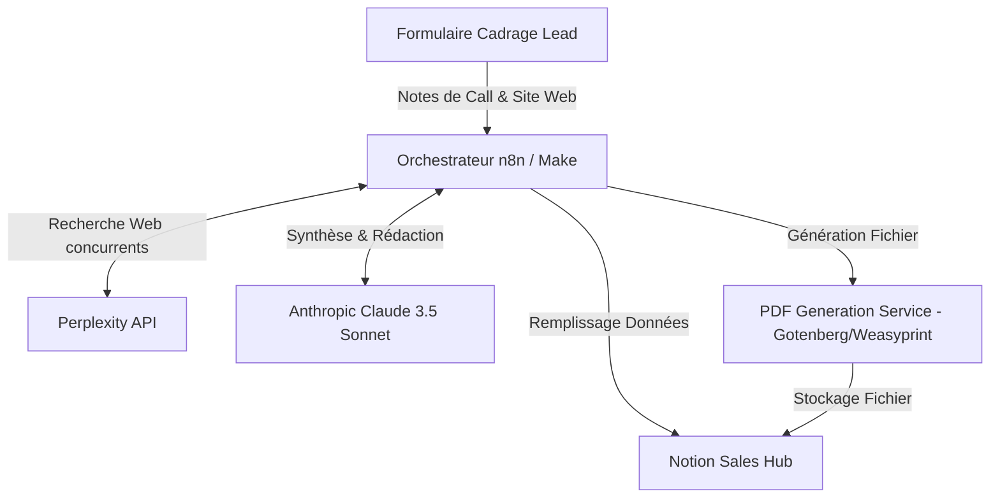
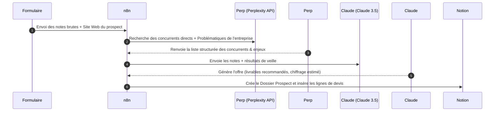
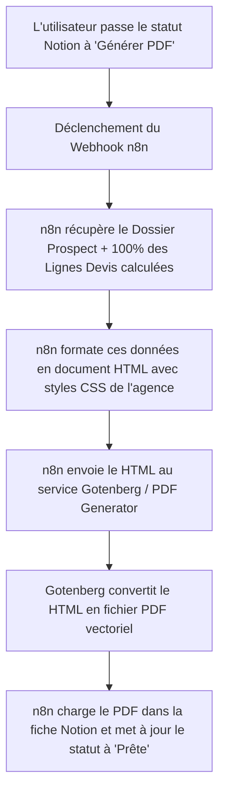

# Architecture Globale & Design Système - Générateur de Propositions
*Document de cadrage technique initial et de flux de données*

Ce document détaille l'architecture macro, le retour sur investissement (ROI) pour un cabinet de conseil ou une agence, et les flux de données (DFD) associés à la génération de propositions commerciales.

---

## 📈 Analyse de Valeur Business (ROI)
* **Temps Humain Consommé :** En moyenne, la rédaction d'une proposition commerciale sur-mesure prend **4 heures** à un collaborateur senior (valeur horaire estimative : 100 €/h), soit un coût interne de **400 €** par devis.
* **Coût de l'Automatisation IA :**
  * Requête Perplexity API (Recherche web avancée) : ~0,05 €
  * Requête Anthropic Claude (Génération de contenu haute qualité) : ~0,15 €
  * Générateur PDF (Service local hébergé) : 0,00 €
  * **Coût total IA par proposition : ~0,20 €**
* **Gain Financier :** Économie de **399,80 €** par proposition éditée, libération immédiate du temps des consultants seniors pour se concentrer sur les appels de closing et la délivrance des projets.

---

## 🏛️ Architecture Macro (Niveau 0)

---

## 🔄 Flux de Données Détaillé

### Niveau 1 : Ingestion, Analyse et Veille

### Niveau 2 : Processus de Génération du PDF de Proposition

---

## 🛡️ Règles d'Ingénierie & Robustesse
* **Fallback sur le Scraping :** Si le site internet du prospect bloque le robot d'analyse en raison de protections (type Cloudflare), le système bascule automatiquement sur une recherche de métadonnées et un résumé textuel fourni par l'API Google Search pour éviter toute panne du workflow.
* **Génération HTML-to-PDF Deterministe :** Pour garantir une mise en page parfaite (pas de sauts de page orphelins, rendu propre des tableaux de prix), nous utilisons Gotenberg (moteur Chromium headless) qui interprète les règles CSS `@media print` de manière déterministe.
