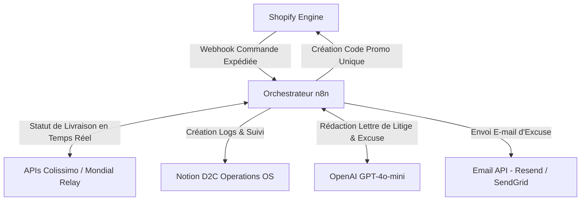
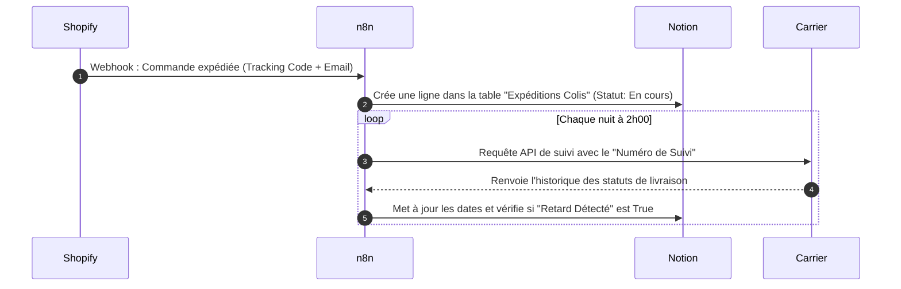
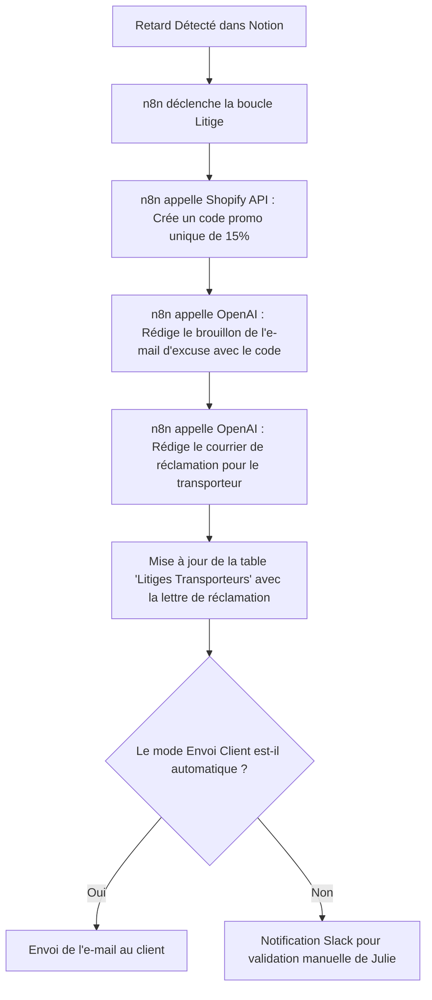

# Architecture Globale & Design Système - Gestionnaire de Litiges
*Document de cadrage technique initial et de flux de données*

Ce document détaille l'architecture macro, les calculs de retour sur investissement (ROI) financiers et les flux de données (DFD) liés à la gestion des litiges logistiques.

---

## 📈 Analyse de Valeur Business (ROI)
Pour une marque E-commerce (D2C) expédiant **5 000 colis par mois** :
* **Taux moyen de retard (Chronopost/Colissimo) :** ~5%, soit **250 colis en retard par mois**.
* **Montant moyen remboursable des frais de port :** ~8,00 € par colis.
* **Manque à gagner mensuel (si réclamations non faites) :** **2 000 € HT** de frais de port perdus par mois.
* **Temps humain nécessaire pour faire 250 réclamations manuelles :** ~25 heures par mois (à 20 €/h = 500 €).
* **Coût de l'automatisation IA (n8n + API tracking + GPT-4o-mini) :** **~18 € par mois**.
* **Gain financier net récupéré :** **1 982 € HT / mois** (Récupération directe sur le P&L + amélioration de la LTV client grâce à l'envoi immédiat du code de réduction de compensation).

---

## 🏛️ Architecture Macro (Niveau 0)

---

## 🔄 Flux de Données Détaillé

### Niveau 1 : Ingestion des Colis et Suivi

### Niveau 2 : Traitement d'un Retard Détecté

---

## 🛡️ Règles d'Ingénierie & Robustesse
* **Gestion des Limites de Requêtes APIs (Rate Limiting) transporteurs :** Les serveurs de tracking des transporteurs bloquent les requêtes massives répétées. Le workflow n8n implémente une file d'attente (Queue Node) avec une temporisation de 500 ms entre chaque appel API pour éviter les blocages d'IP.
* **Auto-Correction des Statuts Suspects :** Si un transporteur indique un statut de livraison vide ou inconnu, le système ne crée pas d'erreur mais place le colis en statut "À revérifier" et retente l'appel 12 heures plus tard avec une requête élargie.
