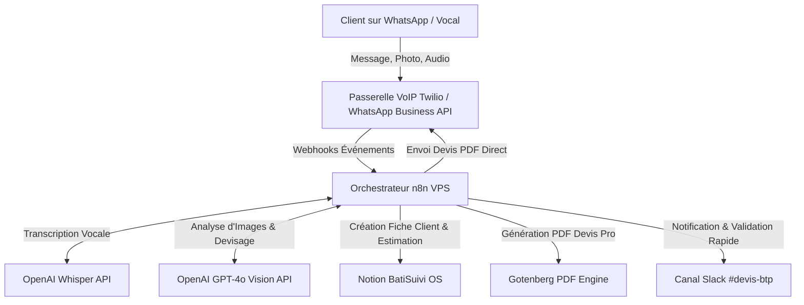
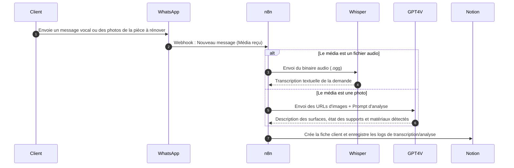
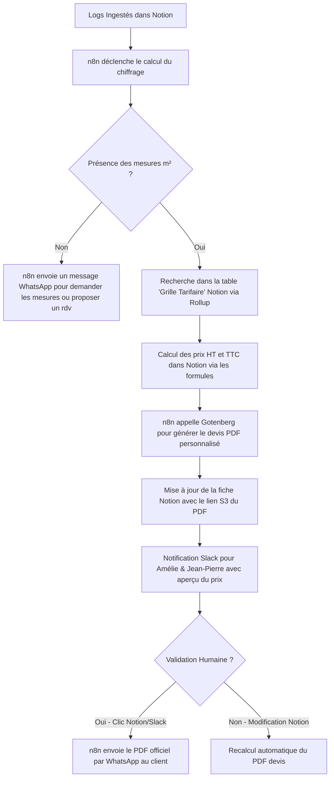

# Architecture Globale & Design Système - Estimateur WhatsApp BTP
*Document de cadrage technique initial et de flux de données*

Ce document détaille l'architecture macro, les calculs de retour sur investissement (ROI) financiers et les flux de données (DFD) liés à la qualification automatique et à la génération de devis par WhatsApp pour le secteur du bâtiment (BTP).

---

## 📈 Analyse de Valeur Business (ROI)
Pour une PME du BTP effectuant des travaux de rénovation résidentielle :
* **Nombre de demandes de devis mensuelles :** ~60 demandes (appels, e-mails, SMS, WhatsApp).
* **Temps moyen de traitement (qualification + déplacement + métrés + chiffrage Word/Excel) :** ~4 heures par projet (déplacement sur site inclus), soit 240 heures par mois pour le gérant (Jean-Pierre).
* **Taux d'abandon/perte de leads (devis envoyés trop tardivement) :** ~35% des prospects signent ailleurs car le chiffrage met plus de 10 jours à arriver.
* **Valeur moyenne d'un chantier signé :** 4 500 € HT.
* **Gain financier de la réactivité (Devis envoyé en <2 heures) :** Augmentation du taux de conversion de +15%, soit **~9 chantiers supplémentaires signés par mois** (= **40 500 € HT de CA additionnel**).
* **Temps administratif économisé :** ~30 heures de secrétariat/chiffrage par mois pour Amélie.
* **Coût de l'automatisation IA (n8n + OpenAI Vision/Whisper + WhatsApp Cloud API + VPS) :** **~45 € par mois**.

---

## 🏛️ Architecture Macro (Niveau 0)

---

## 🔄 Flux de Données Détaillé

### Niveau 1 : Réception du Vocal ou de la Photo WhatsApp

### Niveau 2 : Chiffrage Automatique et Génération PDF

---

## 🛡️ Règles d'Ingénierie & Robustesse
* **Traitement de l'Audio / Limitation de Taille :** Les messages vocaux longs sur WhatsApp peuvent dépasser la limite de taille d'API d'OpenAI. Le workflow intègre un sous-processus de compression et de découpage audio automatique via `ffmpeg` dans le conteneur Docker n8n avant envoi à Whisper.
* **Fallback sur Modèle Tarifaire Sécurisé :** Si GPT-4o-vision n'arrive pas à classer un support ou un matériau, le système applique par défaut le tarif le plus bas de la grille tarifaire avec une mention explicite *"Sous réserve de vérification visuelle par notre technicien"*.
* **Gestion des Relances WhatsApp :** Si un devis PDF envoyé par WhatsApp n'est pas signé ou validé après 48 heures, n8n déclenche une relance automatique courtoise sur WhatsApp avec un résumé textuel des travaux.
