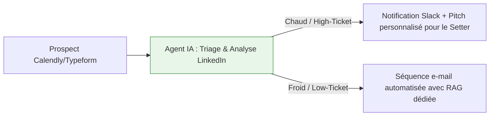
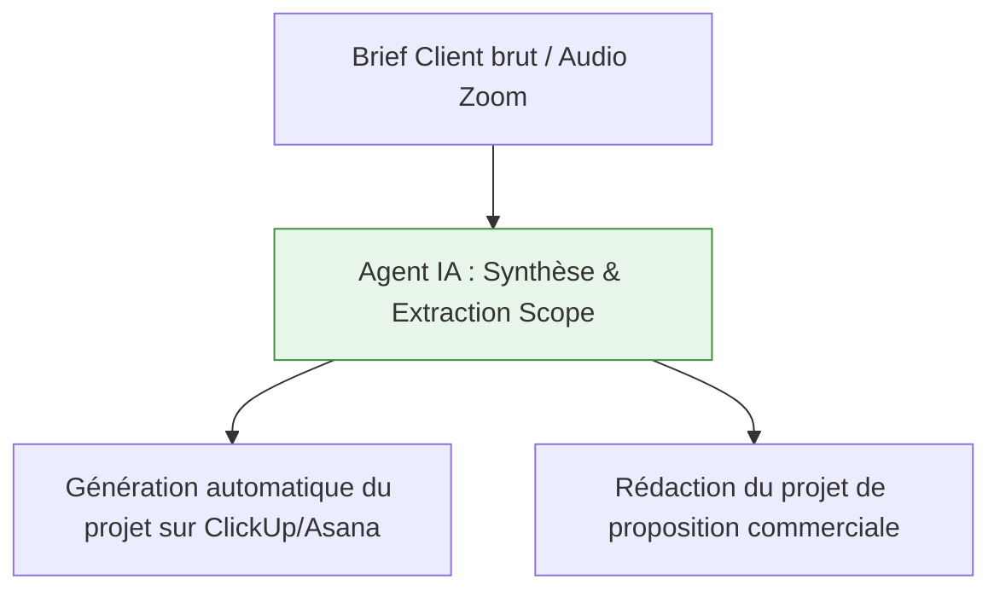
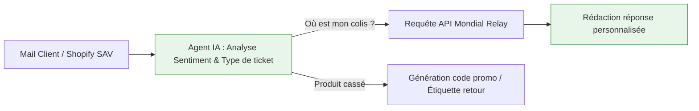
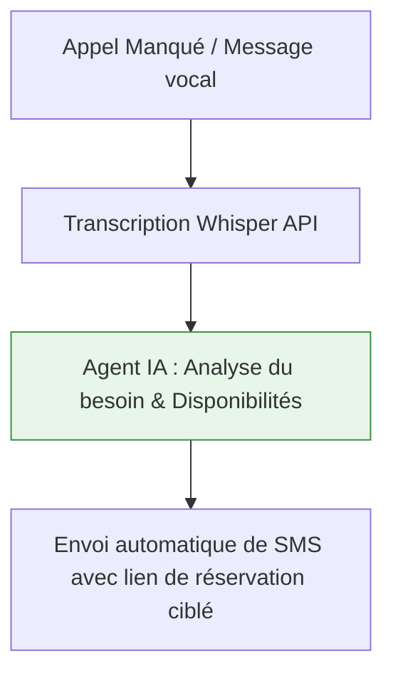

# Le Framework de Transformation Systémique IA & Automatisation
*Par Roland-Caryl Obam — Expert IA & Architecte Systèmes (University of Oxford)*

Ce document présente la méthodologie globale de diagnostic et d'implémentation IA, suivie de déclinaisons ultra-détaillées pour les 4 grandes catégories d'entreprises accompagnées par **Entrepreneurs.com**. Il intègre mes retours d'expérience réels (**Chasr** et **Playfair Capital**), l'usage de **NotebookLM**, ainsi qu'une bibliothèque de **Cas Pilotes Sectoriels** modélisant les problématiques courantes de vos clients.

---

## Part 1 : Le Framework Global "Systemic AI Mapping" (WAT)

L'erreur classique des dirigeants est de vouloir implémenter des outils ("la pharmacie") avant d'avoir cartographié leurs processus ("le diagnostic"). Notre méthodologie repose sur le triptyque **WAT** : **Workflows**, **Agents**, **Tools**.

```mermaid
graph TD
    subgraph 1. WORKFLOWS (Le Squelette Déterministe)
        W1[Audit & Standardisation] --> W2[Simplification & Routage Logique]
    end
    subgraph 2. AGENTS (Le Cerveau Décisionnel)
        W2 --> A1[LLM & NLU - Analyse non-structurée]
        A1 --> A2[Vérification & Auto-correction]
    end
    subgraph 3. TOOLS (Les Membres Opérationnels)
        A2 --> T1[Connecteurs APIs, n8n/Make]
        T1 --> T2[Bases de Données & CRM]
    end

    style W1 fill:#e1f5fe,stroke:#0288d1,stroke-width:1px
    style W2 fill:#e1f5fe,stroke:#0288d1,stroke-width:1px
    style A1 fill:#e8f5e9,stroke:#388e3c,stroke-width:1px
    style A2 fill:#e8f5e9,stroke:#388e3c,stroke-width:1px
    style T1 fill:#fff3e0,stroke:#f57c00,stroke-width:1px
    style T2 fill:#fff3e0,stroke:#f57c00,stroke-width:1px
```

* **Workflows (Le Diagnostic - 90% du projet) :** Le chemin logique de l'information. Nous optimisons le processus *avant* d'ajouter de la technologie pour protéger le P&L.
* **Agents (L'Intelligence) :** Les modèles de langage (LLM) n'interviennent que là où l'humain devait lire, interpréter ou décider (ex : classifier la tiédeur d'un lead).
* **Tools (La Stack) :** L'usage d'outils robustes (n8n, Make, Airtable, APIs) sans sur-tarification ni abonnements SaaS superflus.

---

## Part 2 : Posture de Coaching : "Faire Faire" vs "Faire"

En tant que Coach Expert IA, mon rôle n'est pas d'être un développeur externe isolé, mais un **architecte stratégique** pour le dirigeant :
1. **Autonomie du Client :** Guider l'entrepreneur pour qu'il comprenne son architecture de données. S'il maîtrise son schéma Miro, il sait piloter ses équipes techniques et ses prestataires sans dépendance.
2. **Sobriété Technologique :** Combattre l'over-engineering. Pour un client réalisant 15k€/mois, un simple workflow Zapier/n8n connecté à un tableur suffit. Pour un client à 150k€/mois, nous passons sur des architectures agentiques robustes.
3. **Pédagogie Avancée via NotebookLM :** Pour pérenniser l'accompagnement, chaque use case et chaque entreprise bénéficie d'un **Environnement d'Apprentissage Personnalisé (EAP)** propulsé par NotebookLM.

### 💡 Focus : L'Environnement d'Apprentissage Personnalisé (NotebookLM)
Pour chaque client ou session thématique, nous générons un espace NotebookLM privé contenant :
* Les **SOPs** (Standard Operating Procedures) de l'entreprise cartographiée.
* La **documentation technique** des automatisations livrées.
* Une **bibliothèque de prompts** métiers validés.

Le dirigeant et ses équipes peuvent ainsi interroger leur propre business en langage naturel, générer des résumés d'onboarding pour les nouveaux collaborateurs, ou écouter un podcast récapitulatif de leur workflow généré automatiquement.

---

## Part 3 : Déclinaisons Sectorielles & Applications NotebookLM

### 1. Infopreneurs, Coachs & Organismes de Formation (Modèles High-Ticket)
* **Objectif principal :** Scaler la délivrance et le marketing sans saturer le temps du fondateur.
* **Goulots d'étranglement :** Qualification des leads, onboarding client instantané, relances personnalisées.



* **Implémentation WAT :** Dès le paiement Stripe, automatisation de la création de l'espace membre Notion, des accès Slack, et envoi d'un e-mail vidéo dynamique.
* **Environnement NotebookLM Client :** Un espace d'apprentissage alimenté par tous les scripts de closing, les PDF de formation, et les questions fréquentes des élèves. Les coachs de l'équipe peuvent s'y entraîner pour répondre aux clients avec la voix exacte du fondateur.

---

### 2. Agences B2B & Sociétés de Services (Créatives, Tech, Recrutement)
* **Objectif principal :** Protéger la marge brute et standardiser les livrables opérationnels.
* **Goulots d'étranglement :** Transcription des briefs clients, création automatique de projets (Asana/ClickUp), suivi des deadlines.



* **Implémentation WAT :** Extraction automatique du Scope of Work (SOW) à partir d'un appel Zoom, répartition des tâches sur ClickUp, et relance automatique par Slack des freelances ou collaborateurs en retard.
* **Environnement NotebookLM Client :** Regroupe tous les briefs, propositions signées et documentations de livrables d'un client. L'équipe projet peut interroger le Notebook pour vérifier les contraintes d'un projet sans réécouter les enregistrements audio.

---

### 3. E-commerce & Marques D2C
* **Objectif principal :** Maximiser la Lifetime Value (LTV) et automatiser le support sans dégrader l'expérience client.
* **Goulots d'étranglement :** Suivi de colis (SAV), gestion des litiges, modération et traitement des avis négatifs.



* **Implémentation WAT :** Triage par sentiment. Si le client est en colère, escalade automatique au support humain. S'il s'agit d'une question simple ("Où est mon colis ?"), traitement 100% automatisé par API avec Mondial Relay ou La Poste.
* **Environnement NotebookLM Client :** Entraîné sur la charte de tonalité de la marque, les politiques de retour et le catalogue produit. Le support client humain l'utilise comme assistant pour générer des réponses ultra-précises et conformes à la politique d'entreprise.

---

### 4. PME Traditionnelles & Professionnels Libéraux (Immobilier, BTP, Santé)
* **Objectif principal :** Convertir les appels manqués en rendez-vous et automatiser la relance administrative.
* **Goulots d'étranglement :** Secrétariat téléphonique, relance des devis en attente, conformité réglementaire.



* **Implémentation WAT :** Un message vocal laissé sur le répondeur est transcrit par Whisper. L'IA analyse le besoin, crée la fiche dans le CRM et envoie instantanément un SMS contenant le bon calendrier de réservation.
* **Environnement NotebookLM Client :** Alimenté par les normes de sécurité (BTP), les lois locales (immobilier) ou la nomenclature tarifaire. Le dirigeant peut poser des questions complexes sur un chantier ou un contrat et obtenir une réponse réglementaire immédiate.

---

## Part 4 : Réalisations Réelles (Preuves d'Exécution D'Élite)

### 📊 Cas Réel 1 : Rigueur Opérationnelle & Fiabilité de Données — Le cas **Chasr**
* **L'Impact Business :** Élimination des erreurs de saisie manuelle.
* **La Solution :** Une infrastructure de synchronisation de base de données propre, versionnée sur GitHub, garantissant que 100% des indicateurs de performance (KPIs) du dirigeant soient exacts et mis à jour en temps réel.
* **Leçon de coaching :** Apprendre aux dirigeants à structurer leurs bases de données (la fondation de tout système IA) de façon professionnelle et pérenne.

### 💼 Cas Réel 2 : L'Intelligence Autonome & Résilience — Le cas **Playfair Capital**
* **L'Impact Business :** Analyse de documents financiers à haute valeur ajoutée et gestion des pannes d'API.
* **La Solution :** Un système multi-agents autonome doté d'une logique de **Self-Healing (auto-correction)**. Si une source de données change ou qu'une API échoue, le système s'adapte et trouve une alternative de façon autonome pour éviter les ruptures opérationnelles.
* **Leçon de coaching :** Montrer aux entreprises matures comment déléguer des processus d'analyse complexes à des agents fiables et autonomes.

---

## Part 5 : Cas Pilotes Fictifs (Modèles de Déploiement Pratiques)

Ces cas pilotes illustrent des solutions standardisées que nous pouvons déployer rapidement chez les clients d'Entrepreneurs.com pour générer des gains de productivité immédiats.

### 🤖 Cas Pilote A : Le "Setter Virtuel" Hybride DM-to-Calendly
* **Cible :** *Infopreneurs, Coachs High-Ticket.*
* **Le Problème :** Perte de prospects dans les messages privés (Instagram/LinkedIn) pendant la nuit ou le week-end, et coût élevé du recrutement de setters humains pour un taux de réponse parfois trop lent.
* **La Solution IA :**
  * Surveillance des DMs par webhook (n8n/Make).
  * Agent conversationnel (OpenAI GPT-4o-mini) paramétré avec le ton de l'infopreneur.
  * Triage logique : L'agent pose 3 questions de qualification métier. S'il y a adéquation (ex: budget validé, besoin urgent), envoi automatique du lien Calendly. Si le prospect est tiède, enregistrement dans Airtable pour relance. Si le profil est ultra-stratégique, envoi d'une notification Slack prioritaire pour qu'un humain prenne le relais immédiatement.
* **L'Impact Financier :** Taux de réponse immédiat (< 2 min), +35% de rendez-vous qualifiés réservés en automatique, diminution du coût d'acquisition.

### 📄 Cas Pilote B : L'Agent d'Avant-Vente & Générateur de Propositions sur-mesure
* **Cible :** *Agences B2B, Cabinets de Conseil.*
* **Le Problème :** Rédiger des propositions commerciales détaillées prend en moyenne 4 heures à un consultant senior par prospect, ce qui goulot d'étranglement la phase d'avant-vente.
* **La Solution IA :**
  * Suite à l'appel de découverte, le consultant saisit ses notes brutes (ou charge l'enregistrement audio) dans un formulaire.
  * L'agent (Anthropic Claude 3.5 Sonnet) analyse le site web du prospect (via API de recherche web) et de ses concurrents.
  * Génération automatique d'une proposition commerciale de 3 pages au format PDF (contexte, méthodologie proposée, livrables, tarification estimée) prête à être envoyée.
* **L'Impact Financier :** Réduction du temps de rédaction de 4 heures à 2 minutes. Taux de closing augmenté grâce à l'envoi de la proposition dans l'heure suivant le call.

### 📦 Cas Pilote C : Le Gestionnaire Prédictif & Négociateur de Litiges
* **Cible :** *E-commerce, Marques D2C.*
* **Le Problème :** Perte sèche sur les retards de livraison Mondial Relay / Colissimo car le processus de réclamation manuelle est trop chronophage pour être rentable.
* **La Solution IA :**
  * Un script quotidien scanne les statuts des colis Shopify.
  * Si un colis est livré hors des délais légaux de garantie, l'agent IA génère et envoie une lettre de réclamation officielle au transporteur pour obtenir le remboursement des frais d'envoi.
  * Simultanément, un email personnalisé est envoyé au client final avec un bon d'achat automatique à titre de geste commercial.
* **L'Impact Financier :** Récupération automatique de 8 à 12 % des frais d'expédition facturés par les transporteurs sous forme de remboursements directs, améliorant instantanément la marge nette.

### 📞 Cas Pilote D : Le Secrétaire Vocal & Estimateur WhatsApp Instantané
* **Cible :** *PME de Services Locaux, Artisans BTP.*
* **Le Problème :** Les artisans perdent des opportunités car ils sont sur les chantiers la journée et ne peuvent pas répondre au téléphone ou faire des devis d'estimation le soir venu.
* **La Solution IA :**
  * Un répondeur Whisper transcrit le message vocal d'un client.
  * Le système renvoie un SMS automatique invitant le client à envoyer les photos de la pièce à rénover sur WhatsApp.
  * Un agent de vision (GPT-4o Vision) analyse les photos, estime à la louche les matériaux et la main-d'œuvre, et envoie en moins de 5 minutes une estimation indicative de prix sur WhatsApp, couplée à un lien de réservation de visite de validation.
* **L'Impact Financier :** Captation instantanée du prospect, élimination des demandes non qualifiées sans perdre de temps, et gain de 6 heures par semaine sur le temps de prospection.
